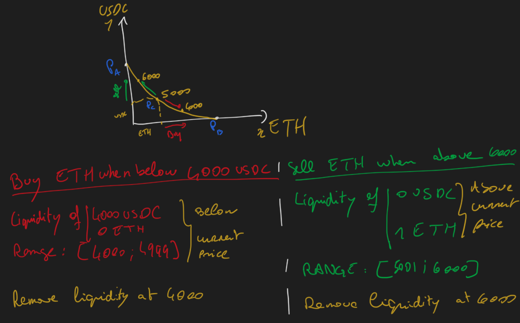
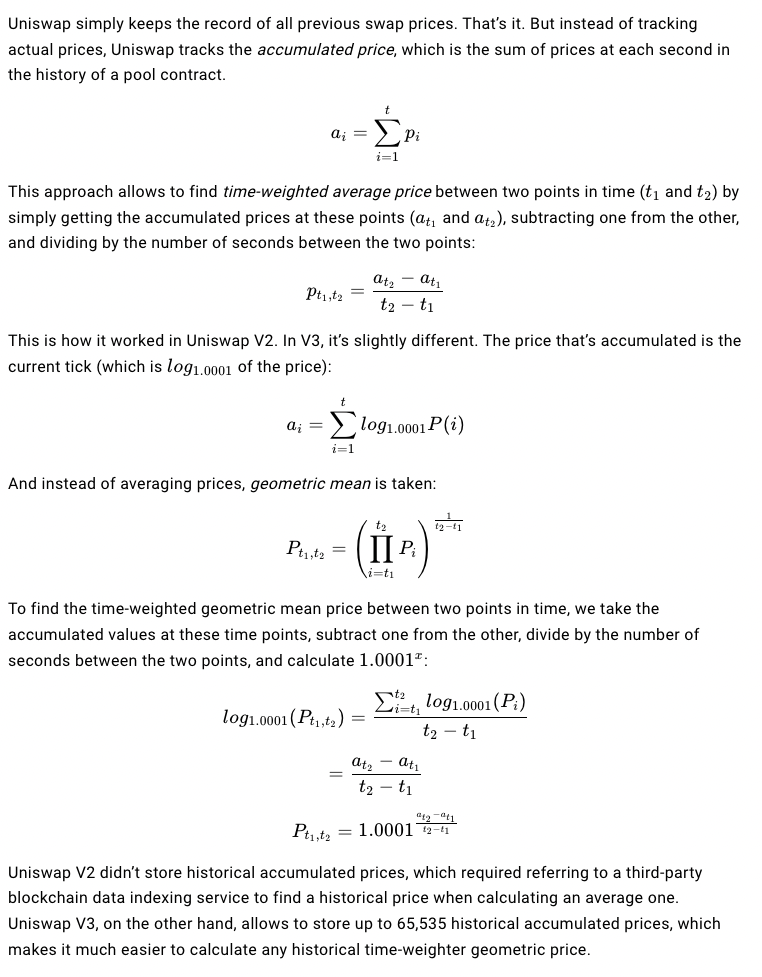
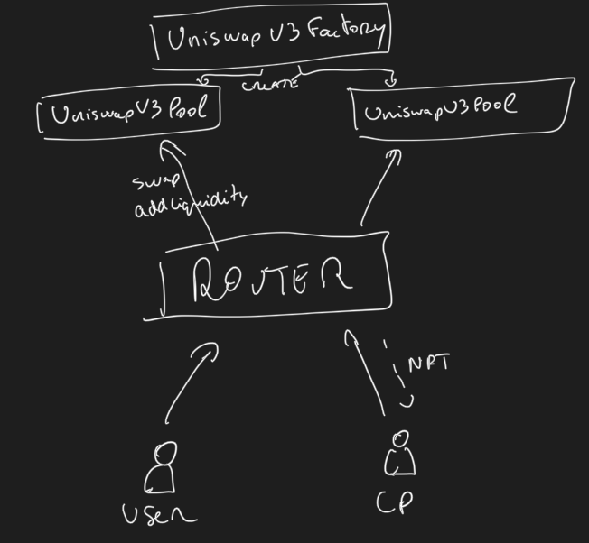
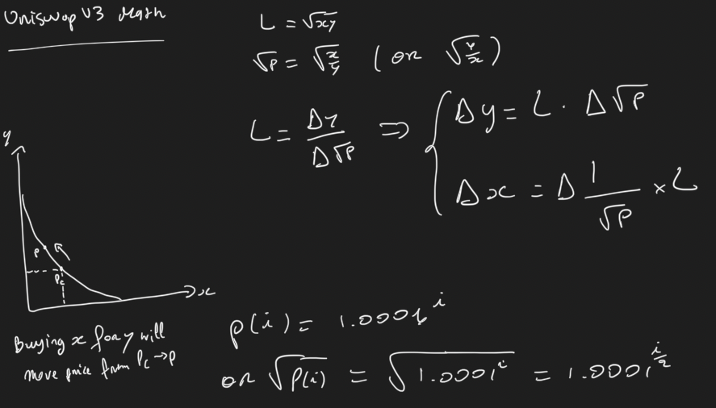
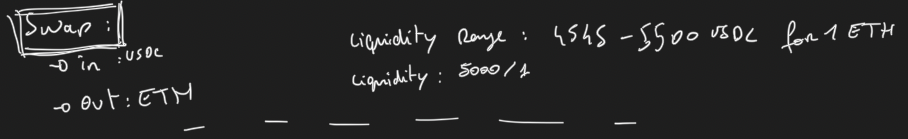
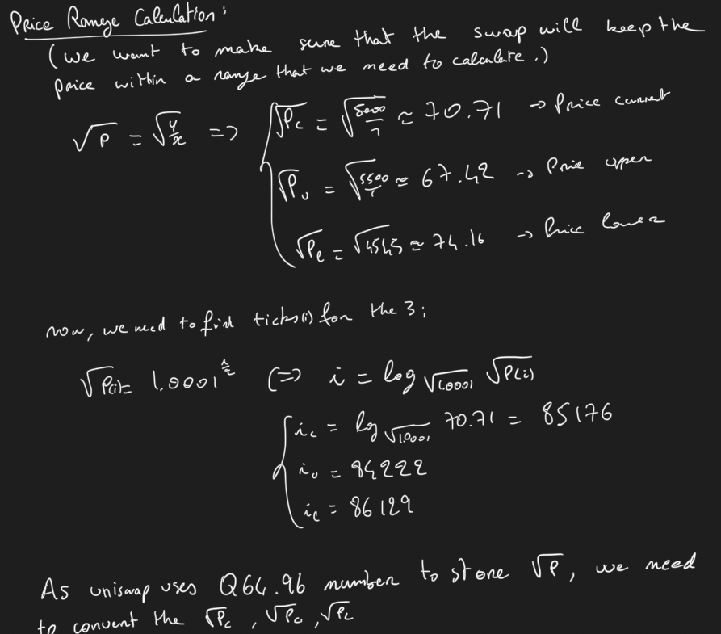
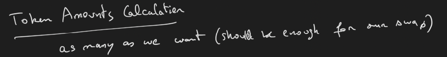
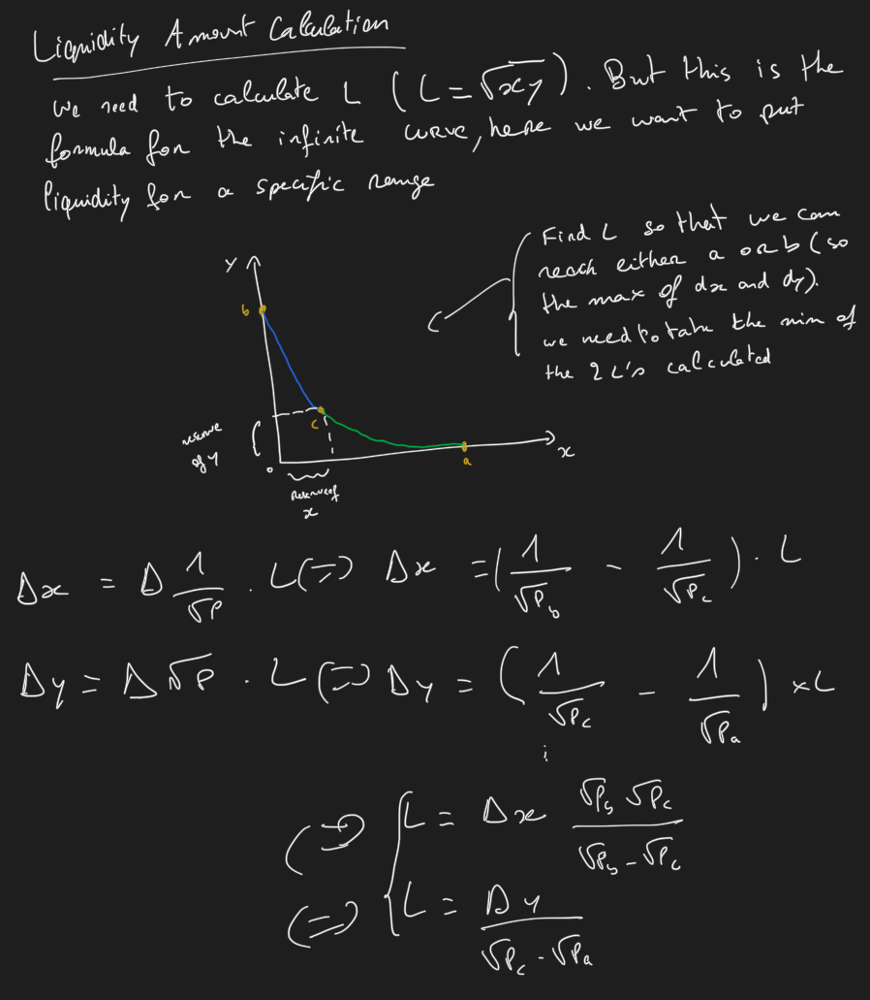

# Uniswap V3

Uniswap V3 Protocol was launched on May 5 2021 with improvments to make it more flexible and efficient.

## Features

To understand the features of v3, we need to understand the flows on v2:
* Pools are treated equally whereas the price volatily of the token is differnt USDC/DAi vs ETH/USDC). Slippage is high on stable coins.
* Liquidity ditributed infinetly in the pool (for USDC only liquidity is distributed in the range of 0.01 to 0.99).

* Concentrated liquidity: liquidity providers can choose the price range where they want to provide liquidity. This will reduce the slippage and increase the liquidity in the range where the price is more volatile.
  * Ticks: price ranges is demarcated by evenly distributed discrete ticks. each tick has an index and corresponds to a certain price p(i) = 1.0001^i
* Limit orders: liquidity providers can use the tick as limit orders. If the price is above the tick, the liquidity provider will sell the token and if the price is below the tick, the liquidity provider will buy the token.

* LP NFT: LP are now NFT due to the uniqueness of their nature (price range). Also the fees are paid to the LP NFT holders and not to the pool.
* Price Oracle: Uniswap provide an on chain oracle for price by using the tick

## Who?
### Liquidity Providers
Provide liquidity to the pool and earn fees from swaps.
### Traders
Swap ERC20 (can be a simple user or arbitrageur)
### Developers/Projects
Uniswap is completely permisionless, meaining anyone can create a pool. Project can then list their token on Uniswap and provide liquidity to their own pool.

## Architecture


## Code
Package: [uniswap-v3-core](https://github.com/Uniswap/v3-core)
* UniswapV3Factory.sol: inheriting from the UniswapV3PoolDeployer.sol, it deploys the pool and stores the address of the pool.
  * stores a parameters struct transiently in storage and clearing it after deploying
  * Use a new notation: `new UniswapV3Pool{salt: PUT_SALT)}()` to use create2
```
parameters = Parameters({factory: factory, token0: token0, token1: token1, fee: fee, tickSpacing: tickSpacing});
pool = address(new UniswapV3Pool{salt: keccak256(abi.encode(token0, token1, fee))}());
delete parameters;
```
* UniswapV3Pool.sol: Represents the Pair (pool) created by the Factory.
  * ticks are stored using a bitmap it corresponds to a map of 2^16 bits. Each bit corresponds to a tick. If the bit is set, it means that the tick is initialized.
  * accessing the tick is done using the `getTick` function which returns the word position and the bit position starting from the right.
  * to flip a tick, a mask is used where the bit position is set to 1 (`1 << bitPos`) and the rest are 0. The mask is then XORed with the word to flip the bit.


```
wordPos = int16(tick >> 8);
bitPos = uint8(uint24(tick % 256));
```
  * 2 structs to store the swap context (as this one is onde iteratively through the ticks map): SwapState and StepState

Package: [uniswap-v3-periphery](https://github.com/Uniswap/v3-periphery)
* ISwapRouter: Router interface to swap tokens
  * exactInputSingle: swap exact amount of token0 for token1. To use with the struct ExactInputSingleParams
  * exactOutputSingle: swap min amount of token0 for token1. To use with the struct ExactOutputSingleParams


## Maths

### uniswap v3 math

### Simple swap

#### Price range

#### Token Amount

#### Liquidity

#### Token Amount 2

#### Swap amount


## Governance
The Uniswap protocol is governed and upgraded by UNI token holders, using three distinct components; the UNI token, governance module, and Timelock. Together, these contracts allow the community to propose, vote, and implement changes to the uniswap protocol.

Any addresses with more than 2.5M UNI delegated to it may propose governance actions, which contain finished, executable code. When a proposal is created, the community can cast their votes during a 3 day voting period. If a majority, and at least 4M votes are cast for the proposal, it is queued in the Timelock, and may be executed in a minimum of 2 days.

## How to use
* Considering the complexity as a user vs uniswap v2, we can consider building a tool on top of v3 to maximize liquidity for the user by chosing the ranges and shifting them. Slippage might be high when we are setting a small range and on the other side, setting a big range is limiting the profit.

## Issues/Flows
* JIT liquidity: https://twitter.com/ChainsightLabs/status/1457958811243778052

## Resources
* https://uniswapv3book.com/
* https://docs.uniswap.org/protocol/concepts/V3-overview/concentrated-liquidity
