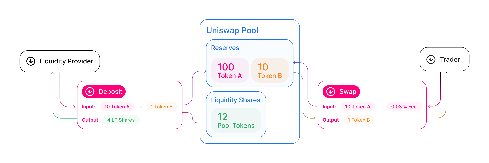
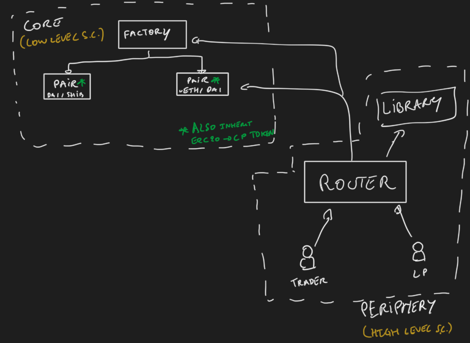
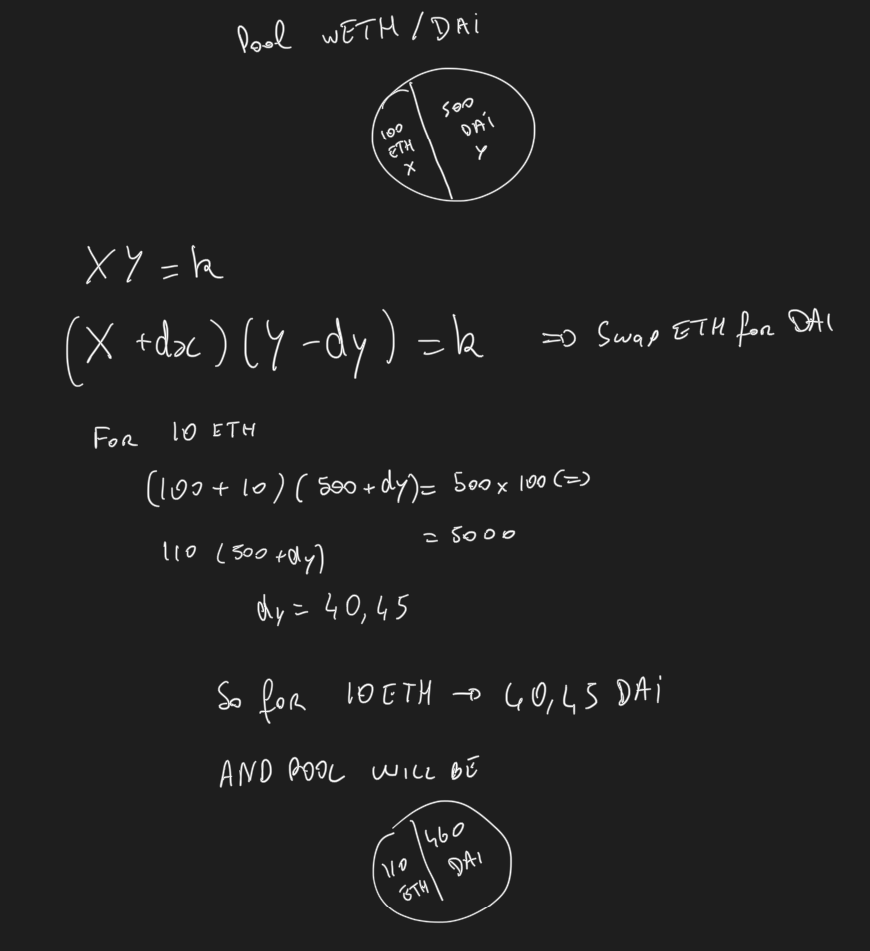
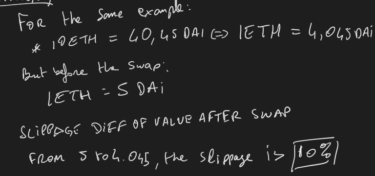
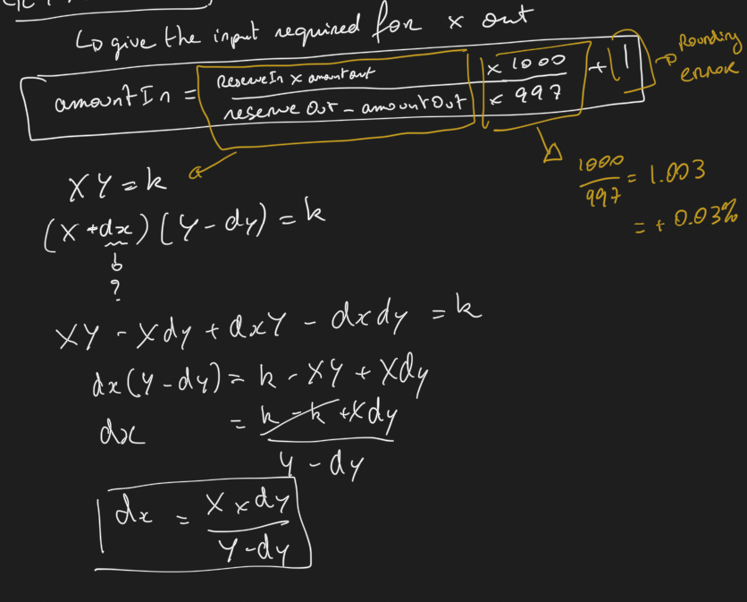
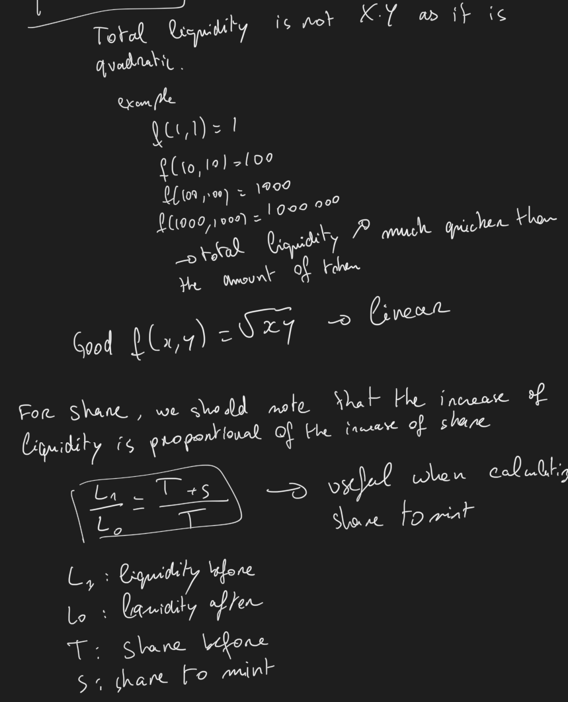
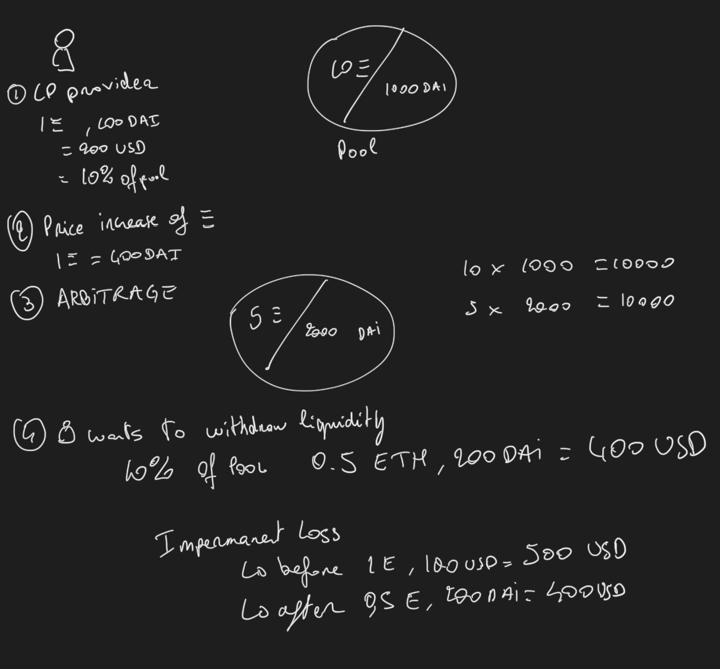

# Uniswap V3

Uniswap V3 Protocol was launched on May 5 2021 with improvments to make it more flexible and efficient.



## Features

To understand the features of v3, we need to understand the flows on v2:
* Pools are treated equally whereas the price volatily of the token is differnt USDC/DAi vs ETH/USDC). Slippage is high on stable coins.
* Liquidity ditributed infinetly in the pool (for USDC only liquidity is distributed in the range of 0.01 to 0.99).

* Concentrated liquidity: liquidity providers can choose the price range where they want to provide liquidity. This will reduce the slippage and increase the liquidity in the range where the price is more volatile.
  * Ticks: price ranges is demarcated by evenly distributed discrete ticks. each tick has an index and corresponds to a certain price p(i) = 1.0001^i

## Who?
### Liquidity Providers
Provide liquidity to the pool and earn fees from swaps.
### Traders
Swap ERC20 (can be a simple user or arbitrageur)
### Developers/Projects
Uniswap is completely permisionless, meaining anyone can create a pool. Project can then list their token on Uniswap and provide liquidity to their own pool.

## Architecture


## Code
Package: [uniswap-v2-core](https://github.com/Uniswap/v2-core)
* UniswapV2Factory.sol: Factory contract to create new pools using CREATE2.
  * a `bytes32` in assembly will represent the address where the variable is stored. Also bytes32 represent an array of 32 bytes slot. The first slot being the size of the array.
  * add(bytecode, 32): give the start of the actual bytecode
  * mload(bytecode): take the 32 bytes which corresponds to the first 32 bytes of the bytes32 = the size of the array.
```
bytes memory bytecode = type(UniswapV2Pair).creationCode;
bytes32 salt = keccak256(abi.encodePacked(token0, token1));
assembly {
    pair := create2(0, add(bytecode, 32), mload(bytecode), salt)
}
IUniswapV2Pair(pair).initialize(token0, token1);
```
* UniswapV2Pair.sol: Represents the Pair (pool) created by the Factory.
  * mint: add liquidity to the pool (by minting LP tokens)
  * burn: remove liquidity from the pool (by burning LP tokens)
  * swap: swap tokens
    * this is allowing flashswap as we will optimistically send the token and then execute the calldata. The calldata should send back the token to the pool (with fee - see [doc](https://docs.uniswap.org/protocol/V2/guides/smart-contract-integration/using-flash-swaps)). For calls without calldata, then we will expect to have already the token_in in the pool.

* UniswapV2ERC20: simple erc20 token implementation (with some utils)

> Note 1: the Core smart contraft only deal with ERC20. So no native token (ETH -> wETH).
> Note 2: we first need to send the tokens to the pair contract before calling the functions. The logic is to calculate the difference of balance before and after to understand how much token where sent

Package: [uniswap-v2-periphery](https://github.com/Uniswap/v2-periphery)
* UniswapV2Router02: a bunch of methods to interact with Pair
  * addLiquidity / addLiquidityETH
  * swapTokensForExactTokens / swapTokensForExactETH / swapExactTokensForTokens / swapExactETHForTokens
* UniswapV2Library: library to calculate the price of a pair
  * getAmountsIn / getAmountsOut (chained call for any number of hops)
  * getAmountIn / getAmountOut

## Maths
Checkout this [youtube video](https://www.youtube.com/watch?v=QNPyFs8Wybk&list=PLO5VPQH6OWdX-Rh7RonjZhOd9pb9zOnHW&index=40) from Solidity Programmer for details explanation of calculations in uniswap v2.

### Simple swap

### Slippage

### Get amount in/out

### Liquidity

### Impermanent loss


## Governance
The Uniswap protocol is governed and upgraded by UNI token holders, using three distinct components; the UNI token, governance module, and Timelock. Together, these contracts allow the community to propose, vote, and implement changes to the uniswap protocol.

Any addresses with more than 2.5M UNI delegated to it may propose governance actions, which contain finished, executable code. When a proposal is created, the community can cast their votes during a 3 day voting period. If a majority, and at least 4M votes are cast for the proposal, it is queued in the Timelock, and may be executed in a minimum of 2 days.

## How to use

## Issues/Flows

## Resources
