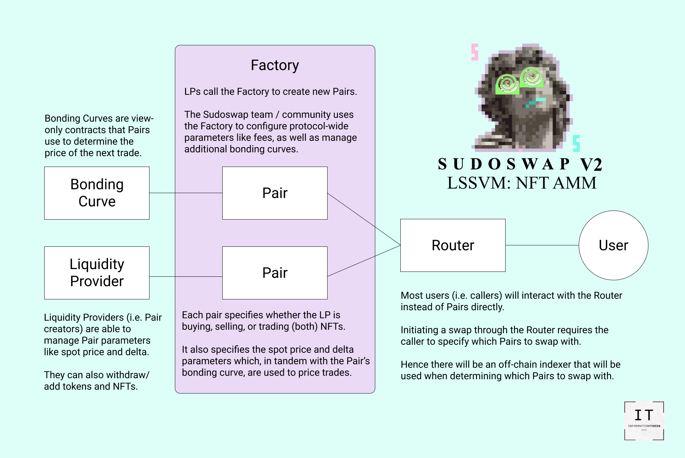
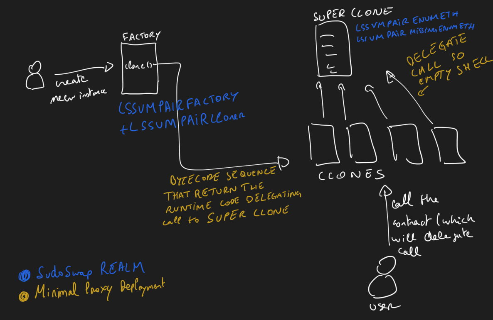

# Sudoswap

Sudoswap is a decentralized exchange for NFTs. It is built on top of Uniswap and uses the same smart contracts. It is a fork of Uniswap, but with a few modifications to support NFTs.

## Features
* Create a pool for any NFT (NFT/ERC20, ERC20/ERC20, NFT/NFT)
* Trade NFTs

## Who?
* LP provider
* Trader
* NFT project (launching a pool)

## Architecture

## Code
[lssvm repo](https://github.com/sudoswap/lssvm):
* Uses of the minimal proxy pattern (EIP-1167)

* For math calculation, Curve uses the [FixedPoint](https://github.com/transmissions11/solmate/blob/main/src/utils/FixedPointMathLib.sol) library from solamte repo

## Maths
Sudoswap invented the sudoAMM algorithm to support NFTs. The algorithm is based on the AMM algorithm, but with a few modifications to support NFTs.

In the classic product contant invariant, the liquidity is distributed over the entire range of potential prices (from 0 to infinity). As a result, LPs do not need to rebalance their liquidity. On the other side, a pool cannot be drained from on or the other asset (price will reach inifinity making it impossible to drain). For NFT, this doesn't seem like an option.

The sudoAMM introduces 2 different invariants:
* Linear: Each time someone trades with a pool with a linear curve, the pool's pricing will be shifted by a fixed amount.
* Exponential: Each time someone trades with a pool with an exponential curve, the pool's pricing will be multiplied by a fixed amount.

Result: better pricing and possibility to deflate a pool (very similar to uniswap v3).

## Governance
No governance for now. The project is still in its early stage.

## Opportunities
* Create arbitrage opportunities with OpenSea. A pool created might introduce a floor price higher than the current price on OpenSea. So buying from OpenSea and selling to the pool will create an arbitrage opportunity.
* Analytics tools (price, volume, liquidity, etc. per Collection or LP)
* Connect NFTLender with sudoswap for
  * getting the price of a NFT
  * liquidating by selling it (potentially only allow lending to collections with a pool).

## Issues/Flows
* Rarity not taken into consideration

## Resources
* https://blog.sudoswap.xyz/deep-dive-1-sudoamm-vs-the-other-amms-they-told-u-not-to-worry-about.html
* https://docs.sudoswap.xyz/
* [Minimal proxy contract - EIP-1176](https://www.youtube.com/watch?v=9xqoK2nKkM4)
* https://blog.0xmons.xyz/83017366310