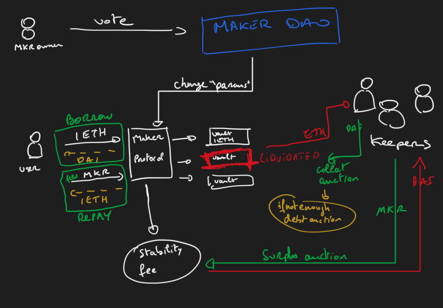

# MakerDAO - Dai

MakerDAO is a decentralized organization dedicated to developping the Maker protocol. The MCD (Multi Collateral Dai) is a set of smart contracts on Ethereum that allow users to generate Dai by locking collateral (ethereum...). Dai is a stablecoin pegged to the US dollar.

## Features
* Borrow with vault (ex-CDP): users can create vault by depositing Ethereum as collateral. In exchange they can mint up to 150% of their collateralized asset in DAI and use it as they wish.
* Flash mint: mint Dai up to a limit set by Maker Governance with the one condition that they pay it all back in the same transaction with a fee.
* Yield: users can deposit Dai in the DSR (Dai Savings Rate) contract to earn interest.
* DAI: ERC20 token on Ethereum pegged to the US dollar.
* MKR: 
  * utility token used to reimburse debt and pay fees
  * governance token used to vote on MakerDAO's decisions
  * Recapitalization token used to recapitalize the Maker protocol in case of a black swan event. Create and sel MKR to raise capital and make the DAO solvent again.

## Who?
* Borrowers: create vaults to borrow Dai and pay fees.
* DAO: Decide on MakerDAO's decisions.
* Keepers: monitor the Maker protocol and execute transactions when needed.
* Price oracles: provide the price of assets used as collateral.
* Oasis: kind of the front end of the Maker protocol. Users can create vaults, deposit Dai in the DSR, buy and sell ETH and MKR.

## Architecture

Keepers:
* Surplus auction: When everything in the system is going well, Dai accrues through stability fees collected from Vaults. Whenever the net surplus from stability fees reaches a certain limit, that surplus in Dai is auctioned off to external actors for MKR which subsequently is burnt, thereby reducing the amount of MKR in circulation
* Collateral auction: The system protects against debt creation by overcollateralization. Under ideal circumstances and with the right risk parameters, the debt for an individual Vault can be covered by the collateral deposited in that Vault. If the price of that collateral drops to the point where a Vault no longer sustains the required collateralization ratio, then the system automatically liquidates the Vault and sells off the collateral until the outstanding debt in the Vault (and a liquidation penalty), is covered.
* Debt Auction: Further, if, for example, the collateral price drops sharply or no one wants to buy the collateral, there may be debt in the liquidated Vault that cannot be repaid through a collateral auction and must be addressed by the system. The first course of action is to cover this debt using surplus from stability fees, if there is any surplus to cover it. If there is not, then the system initiates a Debt Auction, whereby the winning bidder pays Dai to cover the outstanding debt and in return receives an amount of newly minted MKR, increasing the amount of MKR in circulation.

## Code
The map of smart contracts is quite big. The main contracts in the [dss](https://github.com/makerdao/dss) repo are:
* Dai: ERC20 token on Ethereum pegged to the US dollar.
* MKR: ERC20 token used to reimburse debt and pay fees.
* Vat: the core of the Maker protocol. It keeps track of the Dai supply, the debt of each vault, the collateral of each vault, the MKR supply and the surplus.
* Jug: the interest rate model. It keeps track of the stability fee and the DSR.
* Spotter: the price oracle. It keeps track of the price of assets used as collateral.
* Cat: the liquidation engine. It keeps track of the collateralization ratio and the liquidation penalty.
* Vow: the debt engine. It keeps track of the debt and the debt auction.
* Pot: the DSR contract. It keeps track of the DSR.
* Flapper: the surplus auction contract. It keeps track of the surplus auction.
* Flopper: the collateral auction contract. It keeps track of the collateral auction.
* Flipper: the debt auction contract. It keeps track of the debt auction.
* End: the recapitalization contract. It keeps track of the recapitalization
* Join: the adapter contract. It allows to deposit and withdraw ETH and MKR (one contract per asset).

## Maths
As part of the game theory, users are incentivized to keep the price of Dai stable. If the price of Dai is too high, users will be incentivized to mint Dai and sell it on the market to make a profit. If the price of Dai is too low, users will be incentivized to buy Dai on the market and burn it to make a profit.

Example:
* Price above peg: 1 USD = 1.05 Dai
  * User A deposits $150 worth of ETH in the Maker protocol
  * User A mints 100 Dai
  * User A sells 100 Dai on the market for 105 USD

* Price below peg: 1 USD = 0.9 Dai
  * User A deposits $150 worth of ETH in the Maker protocol
  * User A borrows 100 Dai
  * User A closes his vault at a discount ($90 of worth) and gets his deposit back

Other parameters:
* Liquidation ratio: 150%
* Liquidation penalty: 13%
* Stability fee: initially 0.5% but is adjusted by the DAO depending on the market conditions

## Governance
MKR holders can vote on the following:
* Stability fee
* Liquidation ratio
* Liquidation penalty
* Debt ceiling
* Collateral types...

## How to use
* Set up an auction keeper bot to run liquidation
* Leverage: Use ETH as collateral to mint Dai and use it to buy more ETH

## Issues/Flows
* Regulation? 

## Resources

* https://www.youtube.com/watch?v=wW1IEZeWY4k
* https://makerdao.com/en/whitepaper#in-mcd-we-trust
* https://cointelegraph.com/news/makerdao-slashes-stability-fees-as-stablecoin-demand-wanes
* https://docs.makerdao.com/keepers/the-auctions-of-the-maker-protocol